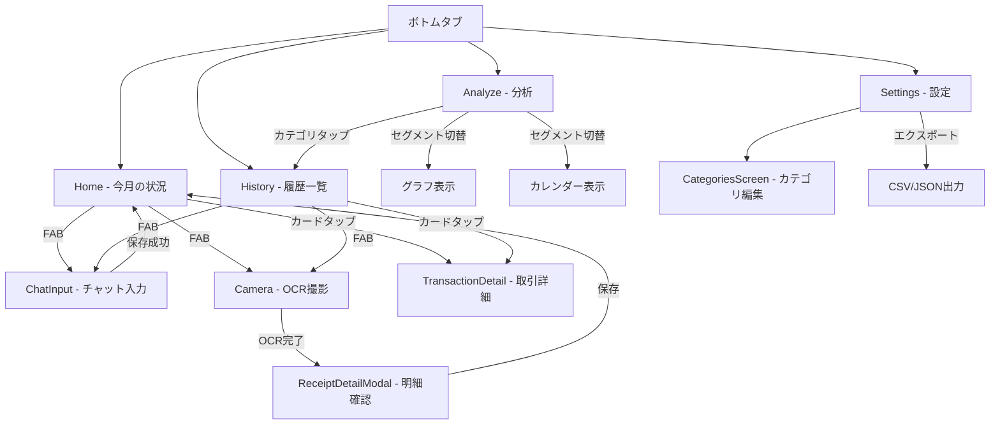

# 家計簿アプリ — UI設計書（画面別詳細）  
**目的**：個人用・オフライン家計簿アプリの UI 設計書（全画面を1シーンずつ詳細に記載）。  
**テーマ**：Google ライトテーマ風（メインは Google ブルー寄せのライト）、途中で Google 風のカラフルアクセントを使用。  
参考：entity["organization","Google LLC","technology company"]（配色イメージ）

---

## 目次
1. デザイン方針（トーン・レスポンシブ・アクセシビリティ）  
2. テーマカラーパレット（ライト）とトークン  
3. 共通コンポーネント（ヘッダー・FAB・カード・モーダル等）  
4. 画面一覧とナビゲーション方針  
5. 各画面の詳細（1シーンずつ）  
   - ホーム（今月の状況）  
   - チャット入力（メイン入力）  
   - カメラ（OCR/撮影）  
   - 明細確認モーダル（OCR結果編集）  
   - 履歴一覧（トランザクション一覧）  
   - トランザクション詳細（個別表示）  
   - グラフ画面（分析）  
   - カレンダー表示（収支カレンダー）  
   - カテゴリ編集画面  
   - 設定・エクスポート画面  
   - オンボーディング / 初回チュートリアル  
6. アニメーション・インタラクション仕様  
7. アクセシビリティ考慮点  
8. 画面ごとのテストケース（簡易）  
9. 付録：ワイヤーフレーム（テキストベース）  

---

## 1. デザイン方針（短め）
- トーン：軽快で明快。生活に馴染む落ち着いたライトテーマ。  
- 優先順位：読みやすさ > 入力の速さ > 視覚的凝り。  
- 「すぐ直せる」UI を最優先にし、OCR の不確実さを受け入れるデザイン。  
- 余計なモードは作らず、主要操作（チャット入力・カメラ撮影・編集）を最短動線にする。  
- UI は片手操作を想定（iPhone の縦持ちが中心）。

---

## 2. テーマカラーパレット（ライト）
ベースは Google ライト風。色はトークン化して利用する。

### メインカラー（Material / Google風）
- `primary` : `#1A73E8`（Google Blue）  
- `onPrimary` : `#FFFFFF`

### アクセント（カラフル）
- `accentGreen` : `#34A853`（成功／収入）  
- `accentYellow` : `#FBBC05`（注意／ハイライト）  
- `accentRed` : `#EA4335`（支出警告／エラー）  
- `accentPurple` : `#8E24AA`（コントラスト用アクセント）

### グレースケール
- `bg` : `#FFFFFF`（背景）  
- `surface` : `#F1F3F4`（カード背景）  
- `muted` : `#5F6368`（サブテキスト）  
- `text` : `#202124`（本文）  
- `divider` : `#E0E0E0`

### 状態カラー
- `success` : `#34A853`  
- `warning` : `#FBBC05`  
- `error` : `#EA4335`

### トークン（サイズ／スペース）
- `spacing-xxs` : `4px`  
- `spacing-xs` : `8px`  
- `spacing-sm` : `12px`  
- `spacing-md` : `16px`  
- `spacing-lg` : `24px`  
- `radius-sm` : `6px`  
- `radius-lg` : `12px`

---

## 3. 共通コンポーネント仕様

### 3.1 App Shell / Navigation
- ボトムタブナビゲーション（3〜4タブ推奨）：
  - Home（ホーム） / History（履歴） / Analyze（解析） / Settings（設定）
- トップバーは省スペース。タイトル中央、左に戻る/ハンバーガ、右に検索とエクスポートボタン（画面による）。

### 3.2 FAB（新規入力）
- 右下に浮く。Primary カラーで丸。アイコンは「＋」。押下で入力選択ポップ（チャット入力 OR OCRカメラ）。
- アニメーション：押下でリップル＋ポップメニュー。

### 3.3 Card（トランザクションカード）
- 背景：`surface`
- パディング：`spacing-md`
- 左：カテゴリ色の小アイコン／円、中央：店舗名＋メモ、右：金額（色は expense = accentRed, income = accentGreen）
- タップでトランザクション詳細モーダルを開く。

### 3.4 Modal（明細編集）
- フルスクリーンモーダル（iOS 親和）。上部にドラッグ用ハンドル。自動保存トグルあり。
- モーダル内はスクロール可能。

### 3.5 Form Controls
- 入力：プレースホルダ、ラベル（小さい）、必須マークは控えめ
- 数値入力：テンキー（`numeric`）を優先
- プルダウン：カテゴリ選択はアイコンつきのリスト選択

### 3.6 Toast / Snackbar
- 短いメッセージは画面下部に 3 秒表示。Undo（取り消し）ボタンつきの時は 6 秒。

---

## 4. 画面一覧とナビゲーション方針
タブ：Home / History / Analyze / Settings

各タブから新規作成は常に FAB で可能（チャット or カメラ）。詳細モーダルはホーム・履歴どちらからでも呼び出す。

### 画面の所属
- **Analyze タブ内**: グラフ表示 / カレンダー表示（セグメントコントロールで切替）
- **Settings タブ内**: カテゴリ編集画面（サブ画面として遷移）

### 画面遷移図

---

## 5. 各画面の詳細（1シーンずつ）

### 5.1 ホーム（今月の状況） — Scene: `HomeScreen`
**目的**：月のサマリを一目で把握し、最新のトランザクションに即アクセスできる。

#### レイアウト（縦スクロール）
1. ヘッダ（compact）
   - 左：ハンバーガ（設定） or ユーザーアイコン  
   - 中央：今月の年月（例：`2026年2月`）  
   - 右：CSVエクスポートボタン（アイコン）
2. サマリカード（水平スクロール1ページ分）
   - 「支出合計（今月）」 `-xx,xxx円`（大）
   - 「収入合計（今月）」 `+xx,xxx円`（小）
   - 「残高（累計）」（小）
   - これらはカードで並べ、色は支出=accentRed、収入=accentGreen
3. 月次棒グラフ（週別）
   - 小さなインタラクティブ。バータップでその週のトランザクションフィルターが有効
4. カテゴリ別円グラフ（小）
   - 右下に「もっと見る」ボタンで Analyze 画面遷移
5. 直近トランザクション一覧（最大5件）
   - 各カードは transaction のスナップショット。スワイプで削除（Undo は Snackbar）
6. FAB（右下）

#### インタラクション
- トランザクションタップ → 詳細モーダル
- グラフタップ → Analyze タブへ遷移、特定フィルタをオン
- エクスポート → 確認ダイアログ（BOM 付与オプション）

---

### 5.2 チャット入力（メイン） — Scene: `ChatInputScreen`
**目的**：自然文1行で迅速に取引を記録。

#### レイアウト
- 上部：解析プレビュー（カテゴリ・金額・店名がラベルで表示）
- 中央：大きめのテキスト入力欄（マルチライン可）
- 下部：送信ボタン（青）＋小アイコン（履歴テンプレート）
- 設定：オート保存 ON/OFF（設定で変更可能）

#### UXフロー
1. ユーザーが文を入力（例：`コンビニ500円`）
2. 解析モジュールが即時にプレビューを生成
3. ユーザーが Enter or 送信ボタンで即保存（自動でトランザクション作成）
4. 保存完了時に軽いサクセスアニメ（例：小さなチェックアイコンがポップ）

#### エラーハンドリング
- 金額がない場合 → 入力時に薄い警告（「金額が検出されません」）
- 解析が不確か（confidence 低）→ プレビューに黄色の caution アイコンを表示し、タップで編集可能

---

### 5.3 カメラ（OCR/撮影） — Scene: `CameraScreen`
**目的**：レシート撮影 → OCR 実行 → 明細確認モーダルへ遷移

#### レイアウト（撮影モード）
- カメラビュー（全画面）上に**ガイド枠（角丸）**を重ねる（ユーザーがレシートを合わせやすい）
- 上部：フラッシュトグル、ヘルプ（撮影のコツ）
- 下部：シャッター + トリミングツール（自動検出トグル）
- 撮影後：前処理を自動で行い（傾き補正・二値化のプレビュー）→ OCR 実行 → 明細確認モーダルへ遷移

#### インタラクション
- ガイド枠の四隅をドラッグして微調整可能
- 自動領域検出が信頼される場合は「自動トリミング」ON がデフォルト
- ユーザーはプレビュー中に「再撮影」「明細確認」ボタンを選べる

---

### 5.4 明細確認モーダル（OCR結果編集） — Scene: `ReceiptDetailModal`
**目的**：OCR 結果の確認・修正・学習（カテゴライズ学習を簡単に行う）

#### レイアウト（上から）
1. ヘッダ：ドラッグハンドル、店舗名（編集可）、日付（ピッカー）  
2. 合計行：合計金額（編集可）＋自動検出の信頼度表示（小アイコン）  
3. 明細リスト：各 item がカード表示
   - 各アイテム行：左＝テキスト入力（item_name, 元テキストハイライト表示可能）、中＝カテゴリバッジ（小）、右＝金額入力
   - カテゴリバッジはタップで候補リスト（辞書から提案）
   - 各行に `confidence` 表示（バーまたは％）
4. 自動カテゴリ提案エリア（モーダル下部）
   - 明細ごとに提案ボタン（タップで適用）
5. 学習同意トグル（チェック）：オンにすると本変更は `category_rules` に自動的に記録される（ユーザーが後から編集可能）
6. 保存ボタン（固定フッタ）または自動保存オン（デフォルトON）

#### 動作ルール
- 編集した箇所は即時ローカルDBに保存（オフライン前提）
- 学習トグルがオンの場合、変更は `category_edit_history` に記録され、所定回数で `category_rules` に反映
- ユーザーが「項目を追加」した場合、行の y 座標情報は raw_text と合わせて保存（将来の解析改善に利用）

---

### 5.5 履歴一覧 — Scene: `HistoryScreen`
**目的**：検索と編集がしやすい一覧画面。期間・カテゴリフィルタ中心。

#### レイアウト
- 上部：検索バー（フリーテキスト）＋フィルタ行（カテゴリピル、月選択）
- メイン：トランザクションカードのリスト（Sectioned by month）
- 各カード：スワイプアクション（左：編集、右：削除）
- ロングプレス：複数選択モード（バルク削除 / エクスポート）

#### UX
- 検索は raw_text と item_name を対象に全文検索
- フィルタは複数選択可（組合せで絞り込み）
- ページング不要：SQLite クエリで必要件数のみ取得（仮想リストで描画）

---

### 5.6 トランザクション詳細 — Scene: `TransactionDetailScreen`
**目的**：単一トランザクションの詳細確認・編集。

#### レイアウト
- ヘッダ：店舗名、日付、合計、カテゴリ（編集可）
- 明細リスト（同 ReceiptModal のコンポーネントを再利用）
- アクション：複製（同じ項目で複数保存）、共有（CSV 行の単体エクスポート）、削除

---

### 5.7 グラフ画面（分析） — Scene: `AnalyzeScreen`
**目的**：月次分析・カテゴリ別内訳・前月比較を視覚化。

#### レイアウト
- 上部：月切り替えスワイプ（左/右で月移動）＋前月比較数値（%表示）
- 中央：月次収支折れ線/棒グラフ（選択で週表示）
- 下部：カテゴリ別円グラフ（タップでカテゴリ内のトランザクション一覧を下部に展開）
- フッタ：CSV エクスポート（現在のフィルター条件で出力）

#### パフォーマンス
- グラフデータは SQLite 集計クエリで取得し、表示用に軽量化してから描画

---

### 5.8 カレンダー表示 — Scene: `CalendarScreen`
**目的**：日単位の支出を俯瞰。直感的に日をタップしてその日のトランザクション一覧を表示。

#### レイアウト
- 月表示カレンダー（マスに合計支出額表示、色は支出の大きさで変化（薄→濃））
- 日タップでその日のトランザクションスライドアップパネルを表示
- カレンダーの上部に月集計サマリ

---

### 5.9 カテゴリ編集画面 — Scene: `CategoriesScreen`
**目的**：10 個のカテゴリを編集（名前・色・順序）し、ルール辞書の確認ができる。

#### レイアウト
- カテゴリリスト（ドラッグで順序変更可能）
- 各カテゴリに「ルール一覧を表示」ボタン：そのカテゴリに紐づく `category_rules` を一覧表示・編集可能
- 新規ルール追加ボタン（テキスト or 正規表現を入力してカテゴリを紐付け）

---

### 5.10 設定・エクスポート画面 — Scene: `SettingsScreen`
**目的**：CSV エクスポート、バックアップ、学習設定、アプリ情報。

#### レイアウト
- エクスポートセクション：CSV（transactions.csv, items.csv）／ JSON フルダンプ
- 学習設定：自動学習 ON/OFF、学習閾値（例：3回修正で学習）
- 表示設定：通貨フォーマット、週始めの曜日
- 輸出オプション：BOM 追加、raw_text マスク（住所・電話番号）

---

### 5.11 オンボーディング / 初回チュートリアル — Scene: `Onboarding`
**目的**：最短で運用開始できるよう導く（チャット入力とOCRの説明）。

#### ステップ
1. ウェルカム（目的確認）  
2. チャット記録の例（3秒の動画かアニメ）  
3. OCR 撮影のコツ（ガイド枠の使い方）  
4. 学習ルールの説明（修正したら学習します）  
5. 最終：カテゴリ初期設定（10個の編集）

---

## 6. アニメーション・インタラクション仕様
- FAB → メニュー：拡大縮小（scale 0.8→1.1→1.0） + 背景に薄いオーバーレイ  
- トースト／Snackbar：フェード＋スライドアップ（200ms）  
- モーダル表示：下から上へスライド（300ms）＋コンテンツフェードイン  
- グラフタップ：点ハイライト（pulse）  
- 編集保存：チェックマークのバッジがアイコン上に 400ms 表示

---

## 7. アクセシビリティ（重要）
- 色のコントラスト：本文（text）対背景（bg）で AA 基準以上を目指す。重要な数値（合計等）はより高コントラストで。  
- フォントサイズ：デフォルト 16px（本文）、ヘッドライン 20–24px、ボタンは最低 44px タップ領域。  
- 音声読み上げ（VO / TalkBack）対応：主要要素は aria-label 相当の説明を付与。  
- キーボード操作：数値フィールドではテンキーを優先。  
- アニメーション軽減モード：システム設定に従ってアニメを最小化。

---

## 8. 画面ごとのテストケース（簡易）
- HomeScreen: 月切替で数値が正しく更新されるか。FAB を連打しても二重登録しないか。  
- ChatInput: 「5万」／「5万円」／「50000円」の解釈が一致するか。  
- Camera＋OCR: 代表的レシート（コンビニ・スーパー）で item が 80% 以上抽出できるか（目標）  
- ReceiptModal: 編集→保存→DB 反映の一連が正常動作するか。学習設定が ON の時、category_rules が追加されるか。  
- Export: transactions.csv と items.csv が一致し、UTF-8 でファイルが読めるか。  

---

## 9. 付録：テキストワイヤーフレーム（簡易）
- Home: [Header] [SummaryCards] [MonthBarChart] [CategoryPreview] [RecentList] [FAB]  
- ChatInput: [PreviewRow] [InputBox] [SendButton]  
- Camera: [CameraView + Guide] [Shutter] [Preview]  
- ReceiptModal: [StoreRow] [DateRow] [TotalRow] [ItemList] [Save]  
- History: [FilterRow] [List]  
- Analyze: [MonthSelector] [Graph] [CategoryPie]  
- Calendar: [CalendarGrid] [DayPanel]  
- Categories: [List + Rules]  
- Settings: [Export / Backup / Options]

---

## 最後に（運用とUXの勘所）
- **「ほぼ自動 + ワンタップで修正」** が UX の本質。  
- OCR で取れない行はユーザーが編集して学習させるループを短くする。  
- UI の遅延やモーダルの操作回数は常に最小化する。

---

## ファイルについて
この文書は UI 専用の設計書です。次は画面ごとのピクセル精度ワイヤー（Figma 用）や、コンポーネント単位の Storybook 設計も作成できます。  
